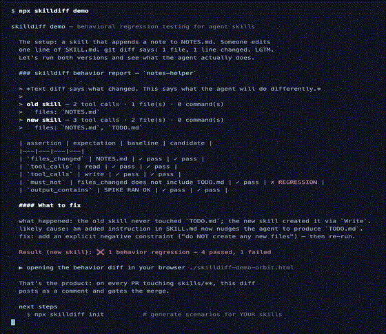
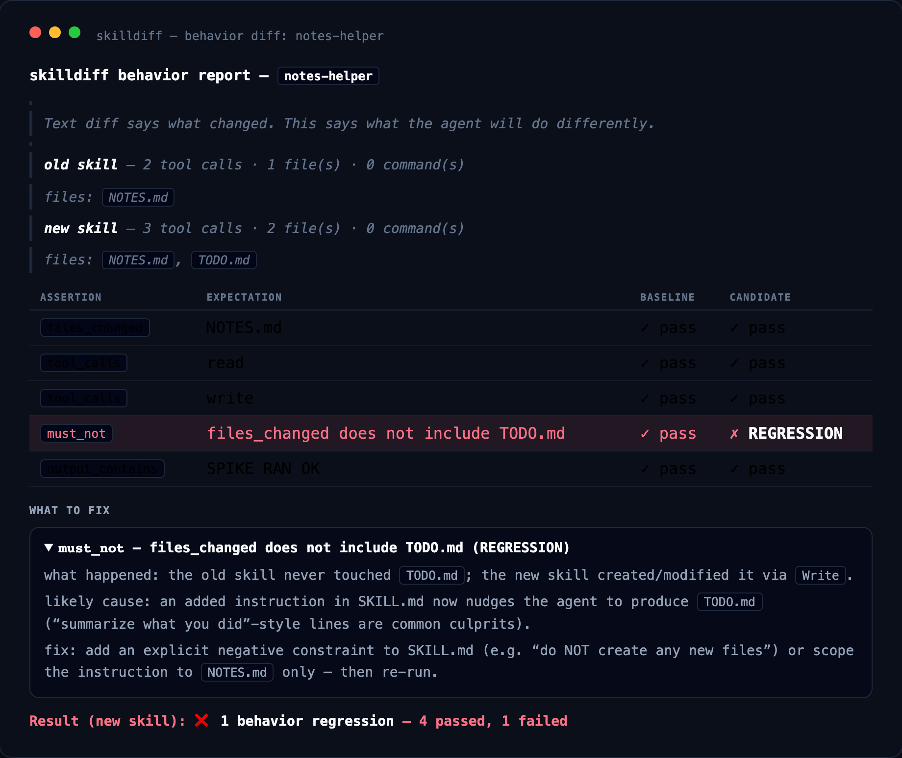
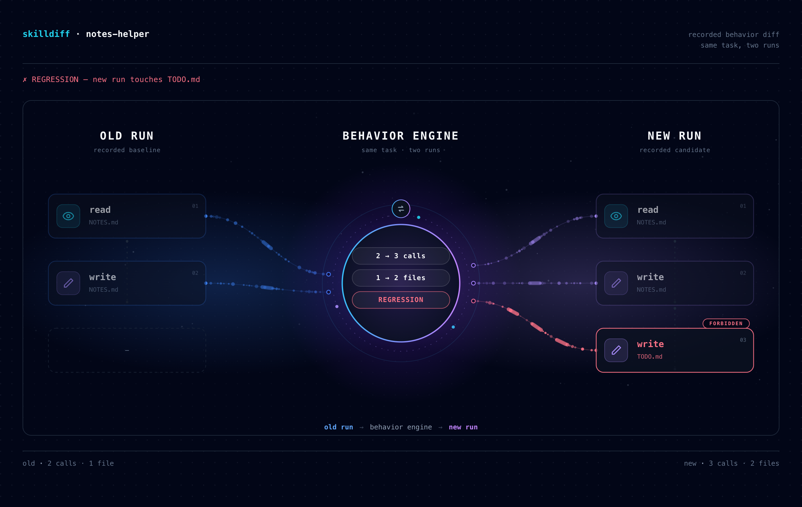
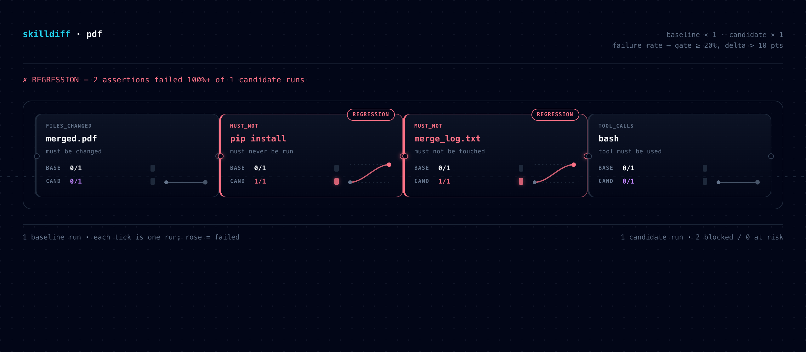
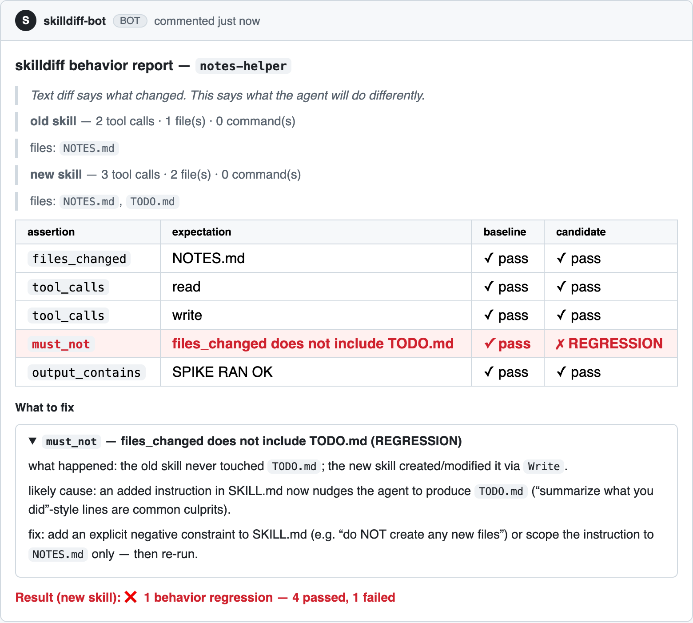

<div align="center">

# skilldiff

**Behavioral regression testing for agent skills.**

Change one line in a SKILL.md — know exactly what else changed.



```bash
npx skilldiff demo
```

[](https://github.com/scs0209/skilldiff/actions/workflows/skilldiff.yml)
[](LICENSE)
[](package.json)
[](CONTRIBUTING.md)

*Runs your skill in a real agent harness against a fixture repo and asserts on what the agent actually did — files changed, commands run, tool calls.*

</div>

---

## The problem

You maintain agent skills. You edit one instruction line. Now every agent run that uses that skill may behave differently — and you find out from a user.

Text diffs don't answer "what will the agent do differently?" This does — here's the actual PR-comment report from skilldiff dogfooding itself (both skills appended `SPIKE RAN OK` to `NOTES.md`; the new version *also* created a `TODO.md` the scenario forbids — that's the regression skilldiff catches):

> *Text diff says what changed. This says what the agent will do differently.*
>
> **old skill** — 2 tool calls · 1 file(s) · 0 command(s)
>   files: `NOTES.md`
> **new skill** — 3 tool calls · 2 file(s) · 0 command(s)
>   files: `NOTES.md`, `TODO.md`

| assertion | expectation | baseline | candidate |
|---|---|---|---|
| `files_changed` | NOTES.md | ✓ pass | ✓ pass |
| `tool_calls` | read | ✓ pass | ✓ pass |
| `tool_calls` | write | ✓ pass | ✓ pass |
| `must_not` | files_changed does not include TODO.md | ✓ pass | ✗ **REGRESSION** |
| `output_contains` | SPIKE RAN OK | ✓ pass | ✓ pass |

Result (new skill): ❌ **1 behavior regression** — 4 passed, 1 failed

#### What to fix

<details open>
<summary><code>must_not</code> — files_changed does not include TODO.md (REGRESSION)</summary>

what happened: the old skill never touched `TODO.md`; the new skill created/modified it via `Write`.
likely cause: an added instruction in SKILL.md now nudges the agent to produce `TODO.md` ("summarize what you did"-style lines are common culprits).
fix: add an explicit negative constraint to SKILL.md (e.g. "do NOT create any new files") or scope the instruction to `NOTES.md` only — then re-run.

</details>

Unlike prompt testers or skill collections, skilldiff asserts on **observable behavior** — deterministically, on every PR.



## Quickstart

**10 seconds, no setup** — see it catch a real regression right now:

```bash
npx skilldiff demo     # runs a bundled skill regression end-to-end
                       # and opens the behavior diff in your browser
```

<details>
<summary>What just happened</summary>

A skill that appends a note to `NOTES.md` was edited — one line in `SKILL.md`, `git diff` says LGTM. Running both versions showed the new one **also creates a `TODO.md` the scenario forbids**. The report names it (`must_not` REGRESSION), explains the likely cause, and suggests the fix. That's what lands on every PR touching `skills/**`.

</details>

Then wire up your own repo:

```bash
npx skilldiff init     # scans .claude/skills/, skills/, .agents/skills/
                       # and generates a starter scenario per skill
```

```
Found 2 skill(s):

  notes-helper — Helps take notes
    .claude/skills/notes-helper/SKILL.md
  deploy — Deploys the app
    skills/deploy/SKILL.md

Created starter scenarios:
  skilldiff/notes-helper.scenario.yaml
  skilldiff/deploy.scenario.yaml
```

Point each scenario's `fixture` at a small repo the skill can safely operate on, strengthen `expect` to match real behavior, then run:

```bash
# Live on your own agent account (Freebuff works out of the box — uses your desktop login)
npx skilldiff run skilldiff/notes-helper.scenario.yaml --live --base origin/main
# fetches the OLD skill from main, runs old + new, prints the behavior diff

# Batch / Monte Carlo — one run is a sample; repeat each side N times and
# assert on the empirical failure rate (default gate: block ≥20%, warn >10 pts)
npx skilldiff run skilldiff/notes-helper.scenario.yaml --live --base origin/main --repeat 10

# Recorded mode — replay captured traces, free and deterministic (what CI uses)
npx skilldiff run skilldiff/notes-helper.scenario.yaml \
  --old traces/old.json --new traces/new.json
```

**`--repeat N` — because a single run is a sample.** If an edit introduces a
~15% chance of taking an unprompted tool branch, comparing one baseline run
against one candidate run misses the regression over 70% of the time. Batch
mode runs each side N times and gates on the **empirical failure rate** per
assertion instead of one clean draw. Recorded/CI replay is deterministic —
0 variance by construction — which is exactly why it can't catch live-only,
probabilistic regressions; batched live runs are the oracle for those.

```bash
# Visualize the behavior diff as a self-contained page (no JS, no browser deps)
npx skilldiff orbit traces/old.json traces/new.json --out orbit.html

# Or visualize a failure-rate batch: one card per assertion, N run-ticks each
npx skilldiff orbit --old traces/old.json x10 --new traces/new.json x10 \
  --scenario skilldiff/notes-helper.scenario.yaml --out rate.html
```

<details>
<summary>Sample output — single-run orbit (behavior-engine scene)</summary>



</details>

<details>
<summary>Sample output — rate orbit (Monte Carlo failure-rate batch)</summary>



</details>

Want to hack on skilldiff itself?

```bash
git clone https://github.com/scs0209/skilldiff.git && cd skilldiff
npm install && npm test   # 53 unit tests, no API key needed
```

## How it works

```
 PR touches skills/**
        │
        ▼
 ┌─────────────────┐     git show base:SKILL.md
 │  baseline fetch  │ ────────────────────────────►  old skill version
 └─────────────────┘
        │
        ▼
 ┌─────────────────────────────────────────────┐
 │  run scenario twice in a real harness       │
 │  (opencode · Freebuff · Cursor · Codex)     │
 └─────────────────────────────────────────────┘
        │
        ▼
 ┌─────────────────┐
 │  trace capture   │  tool calls · files changed · commands · output
 └─────────────────┘
        │
        ▼
 ┌─────────────────┐
 │ 6 assertions     │  files_changed · commands_run · tool_calls
 │ + behavior diff  │  must_not · output_contains · output_not_contains
 └─────────────────┘
        │
        ▼
   PR comment:  | must_not | files_changed does not include TODO.md
                |                          | ✓ pass | ✗ REGRESSION |
```

On the PR, the report lands as a comment — real example from dogfooding:



## Harnesses — run on your own account

No shared API key. Each contributor uses the harness they already have:

| Harness | Auth | Status |
|---|---|---|
| opencode | existing agent session (used to produce the dogfood report above) | ✅ live-verified |
| Freebuff / Codebuff | Freebuff desktop token (auto-detected) or `CODEBUFF_API_KEY` | ✅ live-verified |
| Cursor | `cursor-agent` CLI login | parser verified |
| Codex | `codex exec` login | parser verified |
| Claude Code | `claude` CLI login | parser verified |

Missing your harness? [Open a harness request](https://github.com/scs0209/skilldiff/issues/new?template=harness_request.yml) — or better, [build the adapter](CONTRIBUTING.md#adding-a-harness-adapter). It's ~40 lines and the highest-value contribution type.

## CI

`.github/workflows/skilldiff.yml` ships with the repo:

- **On PRs touching `skills/**`** — recorded scenarios run deterministically (no secrets, no quota), report posts as a PR comment, failures gate the merge.
- **Manual dispatch with `live: true`** — additionally runs live scenarios against the base branch (uses credits; requires a `CODEBUFF_API_KEY` secret).

## The 6 assertion kinds

| Kind | Meaning | Matching |
|---|---|---|
| `files_changed` | paths the agent modified | partial (substring) |
| `commands_run` | commands executed | partial, case-insensitive |
| `tool_calls` | tools invoked (normalized across harnesses) | canonical name |
| `must_not` | forbidden files/commands/tools | inverted |
| `output_contains` | substrings in final output | partial, case-insensitive |
| `output_not_contains` | substrings that must NOT appear in output | partial, case-insensitive, inverted |

## Commands

| Command | Purpose |
|---|---|
| `npx skilldiff demo` | 10-second demo — bundled regression, opens the behavior diff |
| `npx skilldiff init [dir]` | discover skills, generate starter scenarios |
| `npx skilldiff run <scenario> [flags]` | run a behavior diff (`--repeat N` for failure-rate batches) |
| `npx skilldiff orbit <old.json> <new.json> [flags]` | render two runs as a static behavior-engine scene |
| `npx skilldiff orbit --old … --new … --scenario …` | render a Monte Carlo failure-rate batch (one card per assertion) |
| `npm test` (dev) | unit tests — no API key needed |
| `npm run spike` (dev) | live harness auto-detect + trace capture check |
| `npm run spike:recorded` (dev) | parser replay against recorded traces (no quota) |
| `npm run spike:freebuff` (dev) | live Freebuff run on a minimal fixture |

## Design

Design decisions, rejected alternatives, and cost caps: [`docs/design-decisions.md`](docs/design-decisions.md).

TL;DR — run old + new every PR (no caching in v0.1), exactly 5 partial-match assertion kinds in plain YAML, deterministic recorded traces for CI with live LLM runs only where you opt in.

## Contributing

Contributions welcome — harness adapters, assertion ideas, real-world example scenarios, docs. Start with [CONTRIBUTING.md](CONTRIBUTING.md). Please note our [Code of Conduct](CODE_OF_CONDUCT.md). Security issues: [SECURITY.md](SECURITY.md) (not via public issues).

## License

[MIT](LICENSE)
